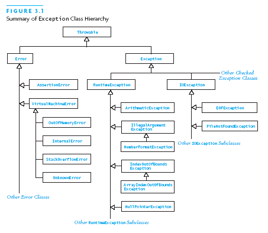
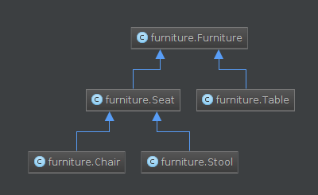

Object oriented programming: inheritance
########################################

:date: 2014-08-17 18:00
:tags: python, twitter, oop
:category: python
:slug: oop-inheritance
:authors: Rob Derksen
:summary: Inheritance of the classes is most often a difficult subject in object oriented programming. In this post, I try to explain this using the furniture example. In a longer example, we use the Twitter streaming API to fetch tweets real time and translate them on the fly.

In this post, we will be looking at the subject inheritance in object oriented programming. This continues on the
`previous post <http://hubsec.eu/blog/object-oriented-programming.html>`_, so if you missed that one, please check it
out first. This will be a long post with a lot of information. The longer example features the Twitter streaming API to
fetch tweets from a given area and translate them at the same time as they are posted.

Prototype of a chair
--------------------
In the previous post, we've looked at different types of furniture. Assuming that a chair has a back and a stool has
neither back nor arms, we can describe the following situations in Python:

.. code-block:: python

    class Chair:
        def __init__(self, legs, material):
            self.legs = legs
            self.material = material
            self.has_seat = True
            self.has_back = True

    class Stool:
        def __init__(self, legs, material):
            self.legs = legs
            self.material = material
            self.has_seat = True
            self.has_back = False

    class Table:
        def __init__(self, legs, material):
            self.legs = legs
            self.material = material
            self.has_surface = True

It's easy to see these classes only differ by a couple of lines. Would it be possible to combine these in a
*superclass* to remove the duplicate code?

Inheritance
-----------
In object oriented programming, there's a hierarchy in class structures. For example, in Java, the hierarchy for Errors
and Exceptions looks like this:

This situation is called inheritance. A class which inherits from another class, derives all it's fields and methods.
In the situation above, we had a lot of duplicate code. If we would create a superclass Furniture and let Chair, Table
and Stool inherit from Furniture, the structure would be clearer. We can even create a class Seat, which derives from
Furniture and let Chair and Stool inherit from Seat. In diagram form, the following is the result:

To show inheritance in Python, define a class with the superclass between parentheses before the colon, for example
``class ExampleClass(ExampleParentClass):``. In the class which derives from a superclass, add a call in the constructor
to the constructor of the superclass: ``super(ExampleClass, self).__init__(arguments, of_the_parents, constructor)``.
The diagram above results in the following code:

.. code-block:: python

    class Furniture:
        def __init__(self, legs, material):
            self.legs = legs
            self.material = material

    class Seat(Furniture):
        def __init__(self, legs, material):
            super(Seat, self).__init__(legs, material)
            self.has_seat = True

    class Table(Furniture):
        def __init__(self, legs, material):
            super(Table, self).__init__(legs, material)
            self.has_surface = True

    class Chair(Seat):
        def __init__(self, legs, material):
            super(Chair, self).__init__(legs, material)
            self.has_back = True

    class Stool(Seat):
        def __init__(self, legs, material):
            super(Stool, self).__init__(legs, material)
            self.has_back = False

Apart from the calls to the super method, we see another new thing in here: *boolean* variables. A boolean is simply a
variable that is either true or false. We've seen this before in conditions for the if-else structure. If a condition
is true, the first block is executed. If it is false, the block in the else is executed. What happens in the background
is the following: the condition is evaluated and results in a boolean variable. The if-else structure checks only the
resulting variable. In Python, we write both true and false with a capital. See the following example for more
information on this subject.

.. code-block:: python

    if True:
        print('This code will always be executed.')
    else:
        print('This code will never be executed.')

    # and the other way around:
    if False:
        print('This code will never be executed.')
    else:
        print('This code will always be executed.')

Twitter streaming API
---------------------
Apart from the REST API, with which we worked in previous posts, Twitter also has a streaming API. The REST API gives
developers access 'static' access to Twitter, while the streaming API gives real time access to the data streams.
More information is available at `dev.twitter.com <https://dev.twitter.com/docs/streaming-apis>`_. In the following
example we combine the streaming API with the Yandex translation API to automatically translate all tweets from the
Donetsk area while they are written. The program runs until you stop it, fetching all tweets, translating them and
writing the results to your screen and to a file.

The library Tweepy, which we used in all examples involving Twitter, has a good documentation on it's use for the REST
API, however it has no documentation on the streaming API, although it perfectly provides support for it. To be able to
use this library, you have to combine your knowledge of the streaming API, documentation available at
`the Twitter docs <https://dev.twitter.com/docs/api/1.1>`_ as well, with the source code of the tweepy library. Apart
from viewing the local version on your computer, you can view it
`online <https://github.com/tweepy/tweepy/blob/master/tweepy/streaming.py>`_ as well. For this example, we will be using
the ``filter`` method of the ``Stream`` class in this file. It's parameters are the same as the ``statuses/filter`` in
the streaming API itself. When we review that part of the documentation, we can see that we should use at least one of
the three predicate parameters: follow, locations or track. Because we are looking for all tweets from a given location,
we will be using the locations parameter. In this example, we are not interested in the follow and the track parameters.
The locations parameter is of the type list and should contain a multiple of four items. Every 'block' of four items
specifies the bounding box of one location. A maximum of 25 locations can be passed to the regular streaming API. When
searching, only tweets from any of these locations are returned.

I guess that is enough information to get started. This example contains two files. The first file is named
``customstreamlistener.py``, the second one is named ``streaming.py``. They are placed in the same directory.
Furthermore, to run the code, an empty directory called ``logs`` has to be created on the same level as these files.
The code will not work out-of-the-box when the name of the first file is changed, I'll explain below why.

.. code-block:: python

    # coding=utf8
    import tweepy
    import logging
    import os
    import datetime
    from yandex_translate import YandexTranslate

    class CustomStreamListener(tweepy.StreamListener):
        def __init__(self, log_filename, yandex_api_key):
            self.logger = logging.getLogger('twitter')
            self.configure_logger(log_filename)
            self.translate = YandexTranslate(yandex_api_key)
            super(CustomStreamListener, self).__init__()

        def configure_logger(self, log_filename):
            self.logger.setLevel(logging.DEBUG)
            file_handler = logging.FileHandler(os.path.join(
                'logs', datetime.datetime.now().strftime(u'%Y-%m-%d_%H|%M|%S_{0}.log'.format(log_filename))))
            file_handler.setLevel(logging.DEBUG)

            console_handler = logging.StreamHandler()
            console_handler.setLevel(logging.INFO)

            formatter = logging.Formatter('%(asctime)s - %(message)s', '%Y-%m-%d %H:%M:%S')
            file_handler.setFormatter(formatter)
            console_handler.setFormatter(formatter)

            self.logger.addHandler(file_handler)
            self.logger.addHandler(console_handler)

        def on_status(self, status):
            translation = self.translate.translate(status.text.replace('\n', ' '), 'en')
            if translation['code'] == 200:
                self.logger.info(u'<@{0}> {1}'.format(status.user.screen_name, translation['text'][0]))

        def on_error(self, status_code):
            self.logger.error(u'Encountered error with status code: {}'.format(status_code))
            return True  # don't kill the streaming api

        def on_timeout(self):
            self.logger.error('Connection timeout')
            return True  # don't kill the streaming api

.. code-block:: python

    # coding=utf8
    import tweepy
    from customstreamlistener import CustomStreamListener

    # Twitter API keys
    twitter = {
        'api_key': 'API KEY',  # replace API KEY with your key
        'api_secret': 'API SECRET',  # replace API SECRET with your api secret
        'access_token': 'ACCESS TOKEN',  # replace ACCESS TOKEN with your access token
        'access_token_secret': 'ACCESS TOKEN SECRET'  # replace ACCESS TOKEN SECRET with your access token secret
    }

    yandex_api = 'API KEY'  # replace API KEY with your translation api key

    location = [
        37.635040,  # Bottom left longitude
        47.917262,  # Bottom left latitude
        37.964630,  # Top right longitude
        48.126684  # Top right latitude
    ]

    auth = tweepy.OAuthHandler(twitter['api_key'], twitter['api_secret'])
    auth.set_access_token(twitter['access_token'], twitter['access_token_secret'])

    custom_stream_listener = CustomStreamListener('Donetsk', yandex_api)

    streaming_api = tweepy.Stream(auth, custom_stream_listener)
    streaming_api.filter(locations=location)

Like any of the previous examples, I'll explain the code in blocks. I'll start with the first file and then move on to
the second one, pointing back at the first when necessary.

.. code-block:: python

    import tweepy
    import logging
    import os
    import datetime
    from yandex_translate import YandexTranslate

Import statements, we've seen them before in previous examples. The ``tweepy`` library is used for the communication
with twitter. We'll be using the logging module, part of the Python standard library (included with the language
itself), to print messages to the screen and saving them to file at the same time. Basically, it is used to log
messages, error messages, debug messages and the like. Next, we import ``os``. This module is part of the standard
library as well and communicates with the operating system of the computer. The ``datetime`` module is also part of the
standard library. It is used for, you guessed it, date and time. Finally, we used the ``yandex_translate`` module
before to translate tweets on the go, which we will be doing again in this example.

.. code-block:: python

    class CustomStreamListener(tweepy.StreamListener):
        def __init__(self, log_filename, yandex_api_key):
            self.logger = logging.getLogger('twitter')
            self.configure_logger(log_filename)
            self.translate = YandexTranslate(yandex_api_key)
            super(CustomStreamListener, self).__init__()

In this block, we create a custom stream listener. The default stream listener from the tweepy library is not sufficient
for usage in this example, so we create our own version of it. To do so, create a class with the name
``CustomStreamListener`` and let it inherit from ``tweepy.StreamListener``. Next, add a constructor with a call to the
constructor of the parent class. That constructor has no obligatory arguments, so we can pass an empty ``__init__``
method to it.

Next, create a logger object and save it as an attribute. We call our logger ``twitter``. In the future, this is an easy
way to see from which module log messages came. In this example, it is not important yet. After that, call the method
``configure_logger(log_filename)``. I'll explain this in the next block. Finally, add an attribute for the ``translate``
object. This will store the Yandex translation api ready for use in every part of the class.

.. code-block:: python

        def configure_logger(self, log_filename):
            self.logger.setLevel(logging.DEBUG)
            file_handler = logging.FileHandler(os.path.join(
                'logs', datetime.datetime.now().strftime(u'%Y-%m-%d_%H|%M|%S_{0}.log'.format(log_filename))))
            file_handler.setLevel(logging.DEBUG)

            console_handler = logging.StreamHandler()
            console_handler.setLevel(logging.INFO)

            formatter = logging.Formatter('%(asctime)s - %(message)s', '%Y-%m-%d %H:%M:%S')
            file_handler.setFormatter(formatter)
            console_handler.setFormatter(formatter)

            self.logger.addHandler(file_handler)
            self.logger.addHandler(console_handler)

This method was made after an example from the Python documentation. I can't explain everything of this without going
into too much detail, so you'll have to accept that this is a genuine way to handle this. See the documentation on
`logging <https://docs.python.org/2/howto/logging-cookbook.html#using-logging-in-multiple-modules>`_ for details.
A couple of things are worth notable. In the second line of the block, we specify a filename for the created log. The
method ``os.path.join`` joins the keywords to a format accepted by every operating system. This way code written on
Linux works on Windows. Windows uses backward slashes to separate directories in the paths, while Linux uses forward
slashes. Instead of writing this all out, it is better to use this method. The first argument to ``os.path.join`` is
used to specify the folder, the last argument to specify the filename. As a filename, we use the current date and time,
followed by a custom filename. This custom filename is specified as parameter in the function definition. A date and
time stamp is formatted by triggering the ``datetime.datetime.now()`` function, then using the ``strftime`` method on
the resulting object. The ``strftime`` function formats the date as a string, in the format specified. This format
uses a couple of special characters. The most important of these are the following:

* %Y - Year (4 numbers, for example 2014)
* %m - Month (2 numbers, for example 08)
* %d - Day (2 numbers, for example 17)
* %H - Hour (2 numbers, for example 18)
* %M - Minute (2 numbers, for example 47)
* %S - Seconds (2 numbers, for example 28)

The resulting string can be formatted using the ``format`` function as well. Because it is unknown what text is passed
to the ``log_filename`` parameter, it is better to use a unicode string for the formatting.

.. code-block:: python

    def on_status(self, status):
        translation = self.translate.translate(status.text.replace('\n', ' '), 'en')
        if translation['code'] == 200:
            self.logger.info(u'<@{0}> {1}'.format(status.user.screen_name, translation['text'][0]))

(Something might have been removed or changed, as my cat decided to jump on my keyboard while I was away...) The
``on_status`` method is part of the original ``tweepy.StreamListener`` class. This method is called every time a tweet
gets posted while listening to the streaming API. As this method is originally defined in the parent class, we
*override* this method with our own functionality. First, we translate the tweet. Next, if the translation succeeded and
returns a status code of 200, we log the tweet, both to the screen and to a file. This is written out in the previous
method. For the details about how this works, see the mentioned link to the Python documentation. The variable
``status.user.screen_name`` contains the username of the person who sent the tweet.

.. code-block:: python

    def on_error(self, status_code):
        self.logger.error(u'Encountered error with status code: {}'.format(status_code))
        return True  # don't kill the streaming api

This method, like the previous method, is defined in the parent class. It is called when an error occurs, for example,
when the location is supplied in the wrong order, an error with status code 406 is returned; it took me a long time
before I realized which caused this error, when I encountered it. If this method returns False, the program exits. As we
don't want the program to stop on an error, we return True to this method.

.. code-block:: python

    def on_timeout(self):
        self.logger.error('Connection timeout')
        return True  # don't kill the streaming api

Like the previous methods, this one is defined in the parent class as well. It is called when the connection has a
timeout, for example when your internet connection drops or Twitter is unreachable. We want this program to continue
running, even when the connection has hiccups or an other error occurs. For this reason, this method also returns True.

.. code-block:: python

    import tweepy
    from customstreamlistener import CustomStreamListener

In the ``streaming.py`` file, we see a regular import statement for the tweepy library. However, this
``customstreamlistener`` is not a library: it is the other file in this directory. It is possible to spread your code
over several files and have the main file import code from the other files. In this case, we only import our
``CustomStreamListener`` class from this file.

.. code-block:: python

    location = [
        37.635040,  # Bottom left longitude
        47.917262,  # Bottom left latitude
        37.964630,  # Top right longitude
        48.126684  # Top right latitude
    ]

I skipped a couple of lines: I copied this part of the program from the example in the second post, as it works exactly
the same in the streaming and the REST APIs. This variable defines the bounding box of the location were we are
searching. The comments describe which coordinate belongs where. Make sure not to accidentally switch them, like I did:
it results in a 406 status code with the ``on_error`` method triggered. I use `WikiMapia <http://wikimapia.org>`_ to
retrieve the coordinates of a location, but other systems can be used as well. I'll write more about WikiMapia in the
next post, where we will be using the PyMapia module, an unofficial Python library for the WikiMapia API, which I wrote
after reading about this site on the excellent website `Bellingcat <https://bellingcat.com>`_.

.. code-block:: python

    custom_stream_listener = CustomStreamListener('Donetsk', yandex_api)

    streaming_api = tweepy.Stream(auth, custom_stream_listener)
    streaming_api.filter(locations=location)

The final part of this example: create an object of the ``CustomStreamListener`` class, initialized with the custom
part of the filename for the logger and the Yandex translation API key. Next, create an object of the ``tweepy.Stream``
class. It takes the authentication object of the ``tweepy.OAuthHandler`` class and our custom stream listener as
parameters. The final line of the file does the searching: filter tweets via the streaming API by location. This fetches
tweets until we stop the program. This is done by clicking on the red square in the bottom left vertical toolbar, which
appears when running the ``streaming.py`` file. Note that running the ``customstreamlistener.py`` file does nothing, it
only works when running our main file.

Conclusion
----------
This was quite a long post. It did contain a lot of new information, but I hope you were able to understand it. It took
me a couple of days to write. In the previous days, the fighting in Ukraine moved closer to Donetsk, so I searched using
this example to find out how close it was to the city of Donetsk. I spent most of the day away from news resources, so
when I heard a couple of hours ago on the news that the fighting reached Donetsk, I realized how accurate this example
was to publish. As I wrote a couple of blocks above, the next post will center on WikiMapia. I'm not entirely sure how I
will put it together, but expect information on the handling of errors. Meanwhile, you can find me on Twitter, where I,
for the last weeks, spent most of my time announcing new posts on this blog: `@boisei0 <https://twitter.com/boisei0>`_
