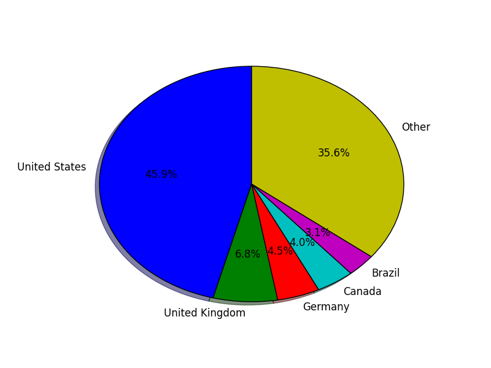

Intermezzo: WikiMapia, Analytics and available sourcecode
#########################################################

:date: 2014-08-23 12:50
:tags: intermezzo
:category: misc
:slug: intermezzo-august14
:authors: Rob Derksen
:summary: A short intermezzo about the next post, analytics on this blog and the availability of the blog's source code.

WikiMapia
---------
It has been almost a week since my last post on this blog and it might take a couple more days until a new one on
programming will appear. In the last one, I wrote that the next post would focus on the 'error handling'-subject using
`WikiMapia <http://wikimapia.org>`_. I was thinking of writing a couple of posts on geolocating, with a `case study
from Bellingcat <https://bellingcat.com/resources/case-studies/2014/08/15/how-to-locate-a-secret-pro-russian-training-camp/>`_
as a manual. I got permission from the writer of this article to cite parts of it. My idea was to split the different
steps over a number of posts with a program in every post. Then later, when all parts were written, to combine it all
in one program covering the full method of geolocating a video.

You might have noticed that I was using the past tense above. The Wikimapia API is still in beta, and while I wrote a
library to cover it, some parts of the system (searching for locations near a set of coordinates) do not work as
expected. Until now, I have not been able to recreate the first part of the geolocating process in a program. I will
continue to improve my searches and/or contact the API developers to see if I'm missing a few things. The next post will
still focus on error handling, but the article set about geolocating has to wait until I can give a working example.

Analytics
---------
When I started writing the first blogpost, I hoped I was able to reach a few journalists who could use the techniques
described here. I wrote four posts, linking to all posts from Twitter. Some of these messages got retweeted or otherwise
shared. I was very happy when I noticed people were actually reading it. However, I had the feeling I could reach more
people if I was able to put up a static link, instead of a fast-read-fast-gone tweet. To do so, I brushed the dust from
my Reddit account, which I hadn't used for at least a year. On the Python subreddit, I posted a link with a short
description.

I'm still stunned of the result. I got about 1900 unique hits the day I posted the link. While writing the posts, I had
arguments with my feelings about the use of third party cookies. As you might have noticed, the blog uses Disqus for the
comments. This will be the only third party system I'm accepting. I'm still arguing about the use of Piwik as an
analytics platform. With Piwik, I'm able to manage and store the data without a third party. Without Piwik, I'm still
able to perform some analytics on my logs. As I'm managing the complete server (not only the website), I have access
to all logs, including the access logs. The access logs tell me when someone with a given ip address visited a certain
part of my website, where they came from and which webbrowser and platform they used when accessing the site.

I wrote a small program to analyze this logfile. A short summary in statistics (since August 17th):

* A total of 2570 unique visitors visited this blog
* 1239 visitors from the United States visited this blog, followed by 184 from the United Kingdom
* 1147 visitors came directly via Reddit
* 42 visitors followed a link on Twitter
* There were 68 hits via Facebook
* 875 visitors used Windows from a computer or tablet, of which 667 were using a 64 bit platform
* 302 visitors used an Android tablet or smartphone, 186 used an iPhone, 78 an iPad and 3 an iPod (touch)
* 412 visitors used a Linux platform other than Android.
* 462 visitors used a Mac.

Blog sourcecode
---------------
I write this blog using the Pelican Python library. Pelican allows me to write all the text in the ReStructuredText
format. When I finished the writing of a post, I compile the text with pelican to a webpage, which I then upload to the
server. All these ReStructuredText files containing the source code of this blog are now available on
`Github <https://github.com/boisei0/blog>`_.
